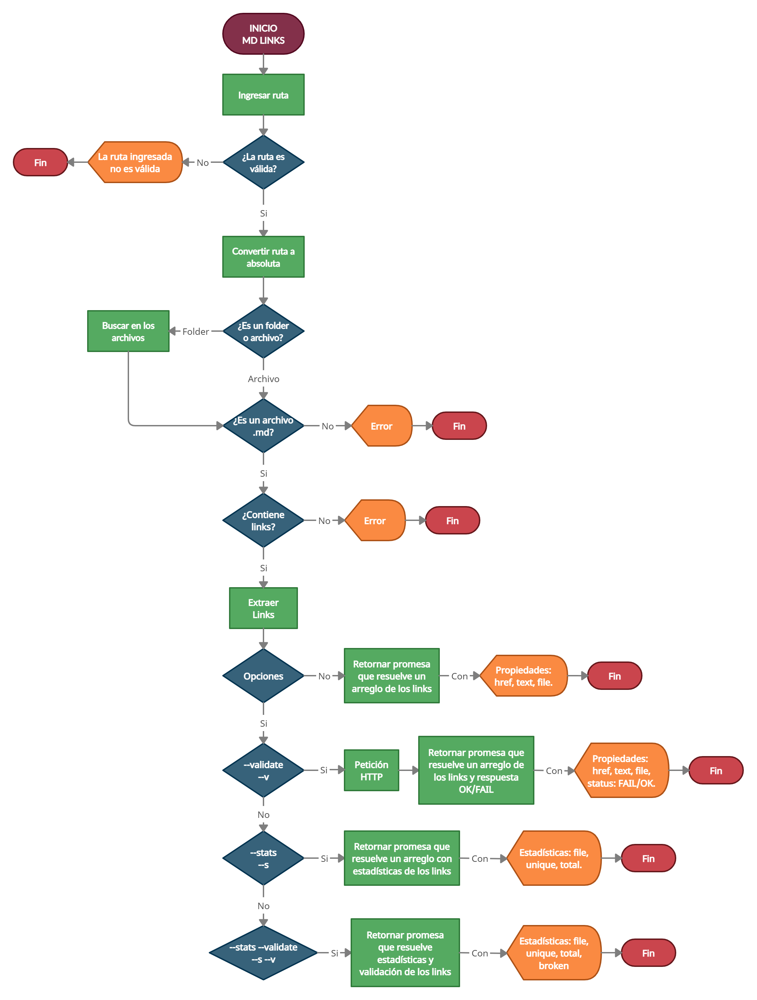

# Markdown Links

## 1. Preámbulo

[Markdown](https://es.wikipedia.org/wiki/Markdown) es un lenguaje de marcado
ligero muy popular entre developers. Es usado en muchísimas plataformas que
manejan texto plano (GitHub, foros, blogs, ...), y es muy común
encontrar varios archivos en ese formato en cualquier tipo de repositorio
(empezando por el tradicional `README.md`).

Estos archivos `Markdown` normalmente contienen _links_ (vínculos/ligas) que
muchas veces están rotos o ya no son válidos y eso perjudica mucho el valor de
la información que se quiere compartir.

Dentro de una comunidad de código abierto, nos han propuesto crear una
herramienta usando [Node.js](https://nodejs.org/), que lea y analice archivos
en formato `Markdown`, para verificar los links que contengan y reportar
algunas estadísticas.

## 2. Diagrama de flujo

<p align = "center"> </p>

## 3. Instalación interfaz linea de comando CLI

### 3.1 Comandos
* **Obtener links e información:** Se puede utilizar un directorio o la ruta de un archivo con extensión .md

* `href`: URL encontrada.
* `text`: Texto que aparecía dentro del link (`<a>`).
* `file`: Ruta del archivo donde se encontró el link.

```sh
$ md-links ./some/example.md
./some/example.md http://algo.com/2/3/ Link a algo
./some/example.md https://otra-cosa.net/algun-doc.html algún doc
./some/example.md http://google.com/ Google
```

* **Obtener validación de los links:** Si pasamos la opción `--validate` ó `--v`, el módulo debe hacer una petición HTTP para averiguar si el link funciona o no. Si el link resulta en una redirección a una
URL que responde **OK**, entonces consideraremos el link como ok.

```sh
$ md-links ./some/example.md --validate
./some/example.md http://algo.com/2/3/ ok 200 Link a algo
./some/example.md https://otra-cosa.net/algun-doc.html fail 404 algún doc
./some/example.md http://google.com/ ok 301 Google
```

* **Obtener el total de links y links únicos:** Si pasamos la opción `--stats` ó `--s` el output (salida) será un texto con la ryta absoluta y estadísticas básicas sobre los links.

```sh
$ md-links ./some/example.md --stats
Total: 3
Unique: 3
```

* **Obtener el total de links, unicos y rotos.** Los comandos `--validate` y `--stats` ó `--v` y `--s` dara como resultado la ruta absoluta del archivo con el total de links, los unicos y rotos que éste contenga.

```sh
$ md-links ./some/example.md --stats --validate
Total: 3
Unique: 3
Broken: 1
```

## 4. Instalación y uso como modulo

```js
const mdLinks = require("md-links");

mdLinks("./some/example.md")
  .then(links => {
    // => [{ href, text, file }, ...]
  })
  .catch(console.error);

mdLinks("./some/example.md", { validate: true })
  .then(links => {
    // => [{ href, text, file, status, ok }, ...]
  })
  .catch(console.error);

mdLinks("./some/dir")
  .then(links => {
    // => [{ href, text, file }, ...]
  })
  .catch(console.error);
```

## 5. Objetivos de aprendizaje

### JavaScript

* [X] Uso de condicionales [(if-else | switch | operador ternario)](https://developer.mozilla.org/es/docs/Learn/JavaScript/Building_blocks/conditionals)
* [X] Uso de funciones [(parámetros | argumentos | valor de retorno)](https://developer.mozilla.org/es/docs/Learn/JavaScript/Building_blocks/Functions)
* [X] Manipular arrays[(filter | map | sort | reduce)](https://developer.mozilla.org/es/docs/Web/JavaScript/Reference/Global_Objects/Array/)
* [X] Manipular objects (key | value)
* [X] Uso ES modules ([`import`](https://developer.mozilla.org/en-US/docs/Web/JavaScript/Reference/Statements/import)
| [`export`](https://developer.mozilla.org/en-US/docs/Web/JavaScript/Reference/Statements/export))
* [X] Diferenciar entre expression y statements.
* [X] Diferenciar entre tipos de datos atómicos y estructurados.
* [X] [Uso de callbacks.](https://developer.mozilla.org/es/docs/Glossary/Callback_function)
* [X] [Consumo de Promesas.](https://scotch.io/tutorials/javascript-promises-for-dummies#toc-consuming-promises)
* [X] [Creación de Promesas.](https://www.freecodecamp.org/news/how-to-write-a-javascript-promise-4ed8d44292b8/)

### Node

* [X] Uso de sistema de archivos. ([fs](https://nodejs.org/api/fs.html), [path](https://nodejs.org/api/path.html))
* [X] Instalar y usar módulos. ([npm](https://www.npmjs.com/))
* [ ] Creación de modules. [(CommonJS)](https://nodejs.org/docs/latest-v0.10.x/api/modules.html)
* [X] [Configuración de package.json.](https://docs.npmjs.com/files/package.json)
* [ ] [Configuración de npm-scripts](https://docs.npmjs.com/misc/scripts)
* [X] Uso de CLI (Command Line Interface - Interfaz de Línea de Comando)

### Testing

* [X] [Testeo unitario.](https://jestjs.io/docs/es-ES/getting-started)
* [X] [Testeo asíncrono.](https://jestjs.io/docs/es-ES/asynchronous)
* [X] [Uso de librerias de Mock.](https://jestjs.io/docs/es-ES/manual-mocks)
* [ ] Uso de Mocks manuales.
* [ ] Testeo para múltiples Sistemas Operativos.

### Estructura del código y guía de estilo

* [X] Organizar y dividir el código en módulos (Modularización)
* [X] Uso de identificadores descriptivos (Nomenclatura | Semántica)
* [X] Uso de linter (ESLINT)

### Git y GitHub

* [X] Uso de comandos de git (add | commit | pull | status | push)
* [X] Manejo de repositorios de GitHub (clone | fork | gh-pages)
* [ ] Colaboración en Github (branches | pull requests | |tags)
* [ ] Organización en Github (projects | issues | labels | milestones)

### HTTP

* [X] [Códigos de status HTTP](https://developer.mozilla.org/en-US/docs/Web/HTTP/Status)

### Fundamentos de programación

* [X] [Recursión.](https://www.youtube.com/watch?v=lPPgY3HLlhQ)

***

